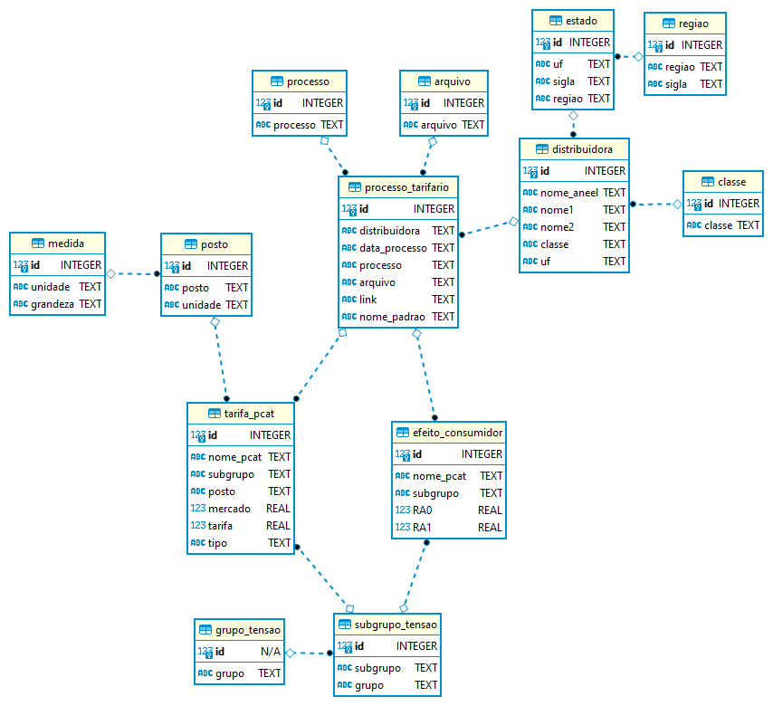

# ANEEL
## Site de coleta:  https://www2.aneel.gov.br/aplicacoes_liferay/tarifa/
###### Tipo de arquivos: SPARTA e PCAT
###### Armazenamento: sqlite3 - processo_tarifario_aneel.db
###### Padrão de nomenclatura em pasta: ARQUIVO_DISTRIBUIDORA_DATAPROCESSO_PROCESSO_(PARTEDOLINK).extensão (normalmente xlsx ou xlsm)

Scraper em python do site da ANEEL para a extração dos arquivos SPARTA e PCAT, o usuário deve executar apenas o main.py, englobando os processos:
- As pastas de arquivamento da SPARTA e PCAT são criadas automaticamente, caso não existam.
- O links já armazenados no banco podem ser baixados para as pastas, caso o usuário desejar.
- O scraper inicializa a seleção dos menus do site da aneel.
- O scraper varre o html do site coletando as informações dos processos tarifários e os arquivos SPARTA e PCAT.
- Caso um processo novo for encontrado, o usuário pode incluí-lo no banco e realizar o download em pasta, com o nome padrão gerado.

Além do mapeamento dos arquivos citados, o banco de dados vem com a extração das tarifas (soma das abas TUSD e TE) e do efeito consumidor médio das PCAT, feitos em outro projeto, para que o usuário possa interagir diretamente com o banco, sem a necessidade do download de todos os arquivos. Abaixo pode-se ver o diagrama do banco de dados, bem como a relação entre as tabelas.  

  

O processo é feito com base no site da ANEEL e todas as informações estão ao público. Dito isso, esse módulo pode ser aprimorado para incluir novos arquivamentos, como as notas técnicas, resoluções homologatórias, dentre outros. Fique a vontade para clonar o repositório e explorar todas as funcionalidades.
